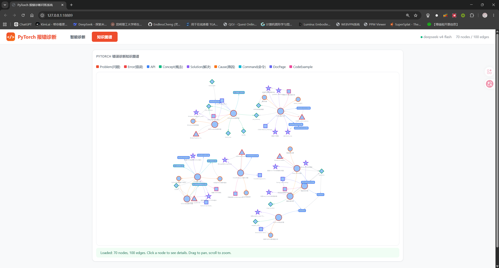
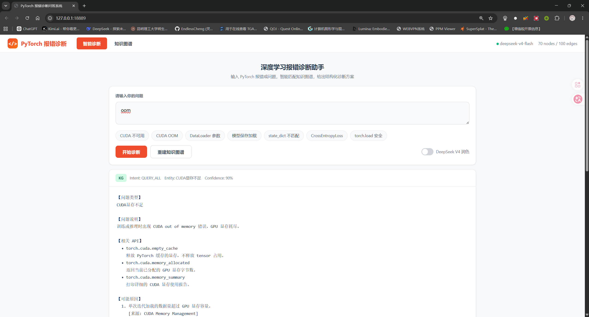
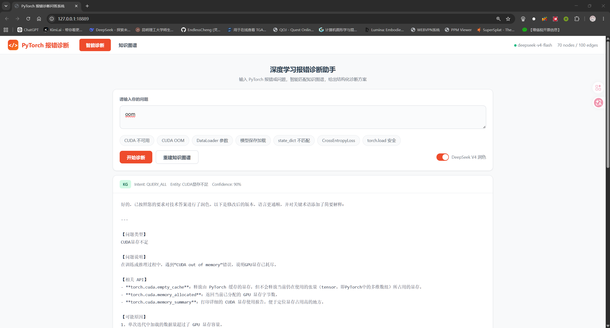

# 基于 PyTorch 官方文档知识图谱的深度学习报错诊断问答系统设计与实现

> 自然语言处理期末大作业报告

---

## 摘要

随着深度学习框架 PyTorch 的广泛应用，初学者和专业开发者在日常使用中频繁遇到各种报错和配置问题。传统的 FAQ 问答系统依赖关键词匹配，难以理解用户意图和提供结构化诊断结果。本文设计并实现了一个基于 PyTorch 官方文档知识图谱的报错诊断问答系统，融合了 FAQ 检索、知识图谱查询、RAG 检索增强生成、DeepSeek 参考证据生成、图形化用户界面和语音播报功能。系统在实现中采用“RAG 优先、知识图谱作为结构化证据层”的混合架构：先从 FAQ 与知识图谱证据块中检索相关上下文，再由大模型或离线模板生成答案，从而兼顾课程要求中的知识图谱可解释性和实际问答效果。系统支持离线运行，可打包为独立可执行程序，面向 PyTorch 初学者提供智能、可解释的错误诊断服务。

**关键词**: 知识图谱；FAQ 问答；PyTorch；错误诊断；DeepSeek；TF-IDF；RAG

---

## 1 绪论

### 1.1 研究背景

PyTorch 是目前最流行的深度学习框架之一，广泛应用于学术研究和工业生产。然而，PyTorch 的灵活性也意味着用户需要面对多方面的技术挑战：CUDA 环境配置、显存管理、数据加载优化、模型序列化与反序列化安全、损失函数输入格式等。对于初学者而言，一个看似简单的报错（如 `CUDA out of memory`）可能涉及硬件驱动、PyTorch 版本、代码实现等多个层面的排查。

传统的解决方案依赖用户自行搜索官方文档、论坛帖子或问答平台。这种方式存在以下不足：

1. **信息分散**：解决方案散布在多个文档页面和社区讨论中；
2. **缺乏结构化**：没有系统性地组织问题、原因、解决方法之间的关系；
3. **检索效率低**：搜索引擎依赖关键词匹配，无法理解深层语义；
4. **答案质量参差不齐**：论坛答案可能过时或不完全正确。

### 1.2 PyTorch 初学者常见问题

通过对 PyTorch 官方文档、GitHub Issue 和社区论坛的系统分析，我们归纳出十大高频问题类别：

1. **CUDA 不可用**: `torch.cuda.is_available()` 返回 `False`
2. **CUDA 显存不足**: `RuntimeError: CUDA out of memory`
3. **PyTorch 安装版本问题**: 安装了 CPU 版本而非 CUDA 版本
4. **DataLoader 参数问题**: `batch_size`、`num_workers` 等参数设置不当
5. **DataLoader 多进程问题**: Windows 下 `BrokenPipeError`
6. **模型保存问题**: 保存整个模型 vs 保存 `state_dict`
7. **模型加载问题**: 跨设备加载、`map_location` 使用
8. **state_dict 不匹配**: `Missing keys` / `Unexpected keys`
9. **torch.load 安全问题**: `weights_only` 参数和 pickle 反序列化风险
10. **CrossEntropyLoss 输入问题**: 输入维度和 target 类型错误

### 1.3 传统 FAQ 问答的不足

传统 FAQ 问答系统（如课程中学习的 `QA System.py`）采用 TF-IDF 向量化和余弦相似度计算，将用户问题与预定义问答对进行匹配。这种方法的优点是简单高效、无需标注数据、可离线运行。但其局限也很明显：

- **浅层匹配**：TF-IDF 基于词频统计，无法捕捉语义相似性，同义词和改写表述难以匹配；
- **答案死板**：返回的是预写的固定答案，无法根据用户意图动态组合信息；
- **知识孤岛**：FAQ 条目之间没有关联，一个问题的答案无法关联到相关的 API、概念和解决方案；
- **覆盖有限**：需要人工编写所有问答对，扩展性差。

### 1.4 知识图谱和大模型融合的意义

知识图谱（Knowledge Graph）通过结构化的三元组（主体-关系-客体）表示领域知识，天然适合描述问题、原因、解决方法之间的关联关系。与纯 FAQ 相比，知识图谱具有以下优势：

- **结构化关联**：一个问题节点可以链接到多个原因、解决方法、相关 API、来源文档；
- **多路径查询**：支持按问题查原因、按 API 查问题、按原因查解决方案等多种查询方式；
- **可解释性**：每条边可以附带证据文本和来源文档，增强答案可信度；
- **可扩展性**：新增知识只需添加节点和边，不影响现有结构。

大语言模型（LLM）在自然语言理解和生成方面具有强大能力。但若让 LLM 自由回答技术问题，存在"幻觉"风险——模型可能编造不存在的 API、错误的安装命令或过时的信息。因此，本系统将 LLM 定位为"参考 RAG 证据的诊断生成器"而非"无约束聊天机器人"：系统先检索 FAQ、知识图谱和文档证据，再由 DeepSeek 参考这些证据组织答案，必要时补充通用排查建议并明确标注。这种设计实现了检索增强生成（Retrieval-Augmented Generation, RAG）的核心理念。

### 1.5 本系统目标

本系统的目标是设计并实现一个可离线运行、可打包部署的 PyTorch 报错诊断问答系统，具体包括：

1. 构建基于 PyTorch 官方文档的轻量级知识图谱；
2. 实现 FAQ、知识图谱与 RAG 检索融合的问答引擎；
3. 集成可选的 LLM 答案润色能力；
4. 提供图形化桌面界面和语音播报功能；
5. 支持 PyInstaller 打包为独立可执行程序。

---

## 2 基础示例程序分析

本章详细分析课程提供的三个基础示例程序，并阐述本项目如何在其基础上进行继承与升级。

### 2.1 `QA System.py` — FAQ 检索式问答系统

`QA System.py` 实现了一个基础的校园 FAQ 问答系统，其核心流程如下：

**知识库构建**：
- 手动编写 FAQ 问答对列表，每条包含 `question` 和 `answer` 字段；
- 知识库规模小（5 条），覆盖校园办事场景。

**文本预处理与向量化**：
- 使用 `jieba` 对中文问题进行分词，解决中文无天然词边界的问题；
- 使用 `TfidfVectorizer` 将分词后的文本转化为 TF-IDF 向量：
  - TF（Term Frequency）：词在文档中出现的频率；
  - IDF（Inverse Document Frequency）：衡量词的区分度，`IDF(t) = log(总文档数 / 包含词 t 的文档数)`；
  - TF-IDF = TF × IDF，高频但低区分度的词（如"的"、"了"）获得低权重。

**相似度计算**：
- 使用 `cosine_similarity` 计算用户问题向量与知识库中所有问题向量的余弦相似度；
- 余弦相似度公式：`cos(A, B) = (A·B) / (||A|| × ||B||)`，取值 [-1, 1]，1 表示完全相同。

**阈值拒答机制**：
- 设置相似度阈值 `threshold=0.2`；
- 当最高相似度低于阈值时，返回兜底回复"抱歉，系统暂时无法回答您的问题"；
- 这一机制有效防止了不相关问题的错误回答。

**继承与改进**：
- 本项目将 FAQ 领域从校园办事升级为 PyTorch 报错诊断；
- FAQ 条目从 5 条扩展到 33 条；
- 每条 FAQ 新增 `answer_ref` 字段，将 FAQ 匹配结果映射到知识图谱节点；
- 保留 jieba 分词、TF-IDF 向量化、余弦相似度、阈值拒答的核心架构；
- 新增 debug 信息输出，展示匹配问题、相似度和图谱节点映射。

### 2.2 `KBQA.py` — 基础知识图谱问答系统

`KBQA.py` 实现了一个医疗领域的知识图谱问答系统，其核心流程如下：

**知识图谱模拟**：
- 使用 Python 字典模拟三元组存储，疾病名称为键，包含症状列表和科室信息；
- 包含 3 个疾病节点：肺部肿瘤、胃溃疡、感冒。

**意图识别与槽位提取（NLU）**：
- 使用正则表达式进行规则匹配；
- 两种意图类型："QUERY_SYMPTOM"（已知疾病查症状）、"QUERY_DISEASE"（已知症状查疾病）；
- 槽位提取通过正则捕获组完成，如 `(肺部肿瘤|胃溃疡|感冒)`。

**模拟 Cypher 查询**：
- 在终端打印模拟的图数据库查询语句（如 `MATCH (d:Disease ...)-[:HAS_SYMPTOM]->(s:Symptom)`）；
- 实际执行的是字典查找逻辑；
- 根据意图和实体返回组合好的答案。

**继承与改进**：
- 知识图谱从"手写医疗字典"升级为"基于 PyTorch 官方文档的多类型节点与关系图谱"；
- 节点类型从单一的 Disease/Symptom 扩展到 9 种类型（Problem、Error、API、Concept、Cause、Solution、Command、DocPage、CodeExample）；
- 关系类型从 2 种扩展到 9 种（HAS_API、HAS_CAUSE、HAS_SOLUTION、CHECK_BY 等）；
- 图谱规模从 3 个节点扩展到 72 个节点、101 条边；
- 意图类型从 2 种扩展到 5 种（QUERY_CAUSE、QUERY_SOLUTION、QUERY_COMMAND、QUERY_EXPLAIN、QUERY_ALL）；
- 查询方式从简单的字典查找升级为邻接表索引 + 关系类型过滤；
- 支持返回 evidence（证据文本）和 source_doc（来源文档）字段。

### 2.3 `LLMTalk.py` — 大模型 API 调用示例

`LLMTalk.py` 展示了如何使用 OpenAI 兼容接口调用大语言模型，其核心流程如下：

**API 配置**：
- 使用 OpenAI Python SDK；
- 配置 `API_KEY`、`BASE_URL`、`MODEL_NAME`；
- 原始示例使用硅基流动（SiliconFlow）作为 API 代理，本项目保留 OpenAI 兼容调用方式，并在实际配置中切换为 DeepSeek 官方接口。

**对话封装**：
- `chat_with_llm(user_message, system_prompt, temperature)` 函数封装了完整的 API 调用流程；
- 通过 `system_prompt` 控制模型角色和回答风格；
- 通过 `temperature` 参数控制生成的随机性（0.1 为严谨学术，0.9 为活泼幽默）。

**角色扮演实验**：
- 低温度（0.1）+ 严谨博导 system prompt → 客观学术的回答；
- 高温度（0.9）+ 幽默助手 system prompt → 亲切口语化的回答；
- 直观展示了 `system_prompt` 和 `temperature` 对模型行为的控制效果。

**继承与改进**：
- 保留 OpenAI 兼容接口的写法；
- 将 API Key 从硬编码改为从 `config.yaml` 和环境变量读取；
- 新增 `enable_llm` 开关，未配置 API Key 时自动降级为离线模式；
- **核心改进**：大模型不再作为无上下文的自由聊天接口，而是接入 RAG 链路。系统先检索 FAQ、知识图谱和文档证据块，再将证据交给 DeepSeek 参考生成诊断答案；
- Prompt 约束从"只能复述上下文"调整为"优先依据 RAG 证据，必要时可补充通用 PyTorch 排查建议，但必须明确标注为补充建议"；
- 新增 `polish_answer()` 与 `fallback_answer()` 方法，在有证据时进行组织和润色，在证据不足时进行谨慎兜底。

### 2.4 本系统的综合改进

三个基础程序各自代表了 NLP 问答系统的三种经典范式，本项目将三者有机融合，并在以下维度实现了质的提升：

| 维度 | QA System.py | KBQA.py | LLMTalk.py | 本项目 |
|------|-------------|---------|------------|--------|
| **知识领域** | 校园 FAQ | 医疗疾病 | 通用聊天 | PyTorch 错误诊断 |
| **知识表示** | 问答对列表 | 字典三元组 | 无 | FAQ + 知识图谱 + RAG 证据块 |
| **检索方式** | TF-IDF 向量匹配 | 正则+字典查询 | API 调用 | RAG 检索 + 图谱证据 + DeepSeek 生成 |
| **意图识别** | 无 | 2 种规则 | 模型理解 | 5 种规则+关键词 |
| **答案形式** | 固定文本 | 结构化拼接 | 自由生成 | 证据增强的诊断答案 |
| **交互方式** | 命令行 | 命令行 | 命令行 | GUI + 语音播报 + CLI |
| **部署方式** | 脚本 | 脚本 | 脚本 | PyInstaller 打包 exe |
| **离线能力** | ✓ | ✓ | ✗（需 API） | ✓（FAQ+图谱+本地 RAG 模板保证离线可用） |

---

## 3 相关技术原理

### 3.1 中文分词（jieba）

中文文本与英文不同，词与词之间没有天然的分隔符。jieba 是目前最广泛使用的中文分词工具，支持三种模式：

- **精确模式**：最精确地切分，适合文本分析；
- **全模式**：扫描所有可能的词语，速度快但存在冗余；
- **搜索引擎模式**：在精确模式基础上对长词再次切分，提高召回率。

本项目采用 jieba 的默认精确模式对 FAQ 问题和用户查询进行分词，作为 TF-IDF 向量化的前置步骤。

### 3.2 TF-IDF 与文档向量化

TF-IDF（Term Frequency-Inverse Document Frequency）是信息检索和文本挖掘领域的经典加权方法。其核心思想是：一个词的重要程度与它在文档中出现的频率（TF）成正比，与它在语料库中出现的文档频率（DF）成反比。

$$
\text{TF-IDF}(t, d) = \text{TF}(t, d) \times \text{IDF}(t)
$$

其中：

$$
\text{IDF}(t) = \log\left(\frac{N}{1 + \text{DF}(t)}\right) + 1
$$

在本系统中，FAQ 的每个问题被 TF-IDF 向量化为一个高维稀疏向量，用户查询也做相同处理，两者的余弦相似度用于判断匹配程度。

### 3.3 余弦相似度

余弦相似度通过计算两个向量夹角的余弦值来衡量它们的相似程度，公式为：

$$
\text{cosine}(A, B) = \frac{A \cdot B}{\|A\| \times \|B\|} = \frac{\sum_{i=1}^n A_i B_i}{\sqrt{\sum_{i=1}^n A_i^2} \sqrt{\sum_{i=1}^n B_i^2}}
$$

余弦相似度的优点是：
- 只关注向量方向，不受向量长度影响；
- 取值在 [-1, 1] 之间，便于设置阈值；
- 计算效率高，适合实时问答。

### 3.4 FAQ 检索式问答

FAQ 检索式问答的流程为：用户输入问题 → 文本预处理（分词）→ 向量化 → 计算相似度 → 排序 → 阈值过滤 → 返回最佳答案。该方法的优点是实现简单、可解释性强、不需要大量标注数据。缺点是只能返回预定义的答案，灵活性有限。

### 3.5 知识图谱与 SPO 三元组

知识图谱是一种用图结构表示知识的方式，图中的节点表示实体（Entity），边表示实体之间的关系（Relation）。最基本的表示形式是 SPO 三元组（Subject-Predicate-Object）：

- **Subject**（主体）：实体，如"CUDA不可用"；
- **Predicate**（谓词）：关系，如 `HAS_CAUSE`；
- **Object**（客体）：实体或属性值，如"未安装NVIDIA显卡驱动"。

多条 SPO 三元组构成一张有向图，支持通过图遍历实现复杂的知识推理。在本系统中，从问题节点出发，沿不同关系类型边遍历，可获取原因、解决方案、相关 API 等信息。

### 3.6 意图识别与实体抽取

**意图识别**（Intent Recognition）：判断用户问句的语言行为目的。本系统定义 5 种意图：询问原因（QUERY_CAUSE）、询问解决方法（QUERY_SOLUTION）、询问检查命令（QUERY_COMMAND）、询问概念含义（QUERY_EXPLAIN）、综合诊断（QUERY_ALL）。

**实体抽取**（Entity Extraction）：从用户问句中识别出具体的实体名称，如 PyTorch API 名、错误类型、参数名等。本系统结合正则表达式匹配和关键词词典两种方法。

### 3.7 检索增强生成（RAG）

检索增强生成（Retrieval-Augmented Generation）是一种将信息检索与大模型生成相结合的技术范式。其流程为：

1. 用户输入问题；
2. 从知识库中检索相关文档/知识；
3. 将检索结果作为上下文输入大模型；
4. 大模型基于上下文生成回答。

RAG 的核心优势在于：既利用大模型的语言理解和生成能力，又通过检索结果约束和增强模型的输出，减少"幻觉"。本系统的最终设计采用"RAG 优先"策略：`modules/rag_retriever.py` 从 `data/doc_chunks.json`、FAQ 和知识图谱中检索证据，问答引擎再将证据交给 DeepSeek 参考生成答案；当未配置 API 或网络不可用时，系统自动退回本地模板答案，保证离线可用。

### 3.8 大模型 Prompt 约束

通过在 system prompt 中设置严格的行为约束，可以有效控制 LLM 的输出行为。本系统对 LLM 的核心约束包括：

1. 优先根据提供的 RAG 证据回答；
2. 不要编造 PyTorch API 名称或函数签名；
3. 不要编造 pip install 或 conda install 命令；
4. 如果信息不足，明确告知用户需要补充什么信息；
5. 如需补充通用 PyTorch 排查建议，必须与"基于证据的结论"区分开。

这些约束通过 system prompt 注入，结合低 temperature（0.3）来保证输出的稳定性和可靠性。

### 3.9 语音合成

语音合成（Text-to-Speech, TTS）技术将文本转换为口语输出。本系统使用 `pyttsx3` 库，它是一个跨平台的离线 TTS 引擎，支持 Windows SAPI5、macOS NSSpeechSynthesizer 和 Linux eSpeak，无需网络连接即可工作。系统在初始化时自动检测可用语音引擎，不可用时优雅降级。

### 3.10 PyInstaller 打包

PyInstaller 是一个将 Python 程序打包为独立可执行文件的工具。它将 Python 解释器、依赖库和用户代码打包到一个目录中，使得用户无需安装 Python 环境即可运行程序。本系统采用文件夹模式（`-D`）打包，便于管理和更新数据文件。关键挑战是处理资源文件路径：开发环境中文件相对于源码目录，打包后文件相对于可执行文件目录。本项目通过 `utils/path_utils.py` 中的 `sys.frozen` 检测实现路径自适应。

---

## 4 系统需求分析

### 4.1 功能需求

| 编号 | 功能 | 描述 |
|------|------|------|
| F1 | 知识图谱构建 | 支持从配置文件读取文档 URL，抓取或使用内置文本，抽取实体和关系，构建知识图谱 |
| F2 | FAQ 检索 | 支持 33 条 FAQ，使用 TF-IDF 和余弦相似度匹配，阈值过滤 |
| F3 | 意图识别 | 自动识别用户意图：问原因、问解决、问命令、问概念、综合诊断 |
| F4 | 实体抽取 | 自动识别 PyTorch API、错误关键词、参数名、问题类型 |
| F5 | 知识图谱查询 | 支持按实体名、意图类型、关系类型查询，返回结构化结果 |
| F6 | 大模型集成 | 支持 OpenAI 兼容接口和 DeepSeek，用于参考 RAG 证据生成答案（可选） |
| F7 | 桌面 GUI | Tkinter 图形界面，支持输入、诊断、清空、朗读等功能 |
| F8 | 语音播报 | 离线朗读诊断结果 |
| F9 | 语音输入 | 支持麦克风语音输入（扩展模块） |
| F10 | FastAPI 后端 | 提供 REST API，支持外部调用 |
| F11 | 打包部署 | 支持 PyInstaller 打包为独立 exe |

### 4.2 非功能需求

- **离线可用**：不依赖大模型 API 也能完成核心问答（通过 FAQ、知识图谱和本地 RAG 模板）；
- **响应速度**：本地问答响应时间 < 2 秒；
- **可扩展性**：数据文件（FAQ、知识图谱、配置）以 JSON/YAML 格式存储，便于修改；
- **跨平台**：核心代码兼容 Windows、macOS、Linux（部分语音功能依赖平台 API）；
- **容错性**：网络不可用、语音引擎不可用、LLM API 不可用时自动降级。

### 4.3 应用场景

1. **PyTorch 初学者自学**：遇到报错时快速获取结构化诊断和建议；
2. **教学辅助**：教师在课堂上演示常见报错的排查过程；
3. **开发辅助**：开发者在编码过程中快速查询 API 用法和参数说明；
4. **离线环境**：在无网络的服务器或实验环境中使用。

### 4.4 用户输入输出示例

| 输入 | 预期输出 |
|------|---------|
| `torch.cuda.is_available() 返回 False 怎么办？` | 问题类型: CUDA不可用；原因：未安装驱动/CPU版本；解决：检查驱动/重新安装；命令：nvidia-smi |
| `CUDA out of memory 怎么解决？` | 问题类型: CUDA显存不足；原因：batch_size过大；解决：减小batch_size/使用AMP；命令：查看显存 |
| `DataLoader 的 num_workers 是什么意思？` | 概念说明: num_workers 是子进程数；相关问题: 多进程问题；参数说明 |
| `CrossEntropyLoss 输入维度应该是什么？` | 问题类型: 输入问题；API: CrossEntropyLoss；输入格式: logits (N,C), target (N,) LongTensor |

---

## 5 系统总体设计

### 5.1 系统架构

本系统采用分层架构设计，分为表现层、业务逻辑层、数据层三层：

```
┌──────────────────────────────────────────────────────────────┐
│                        表现层                                │
│  ┌─────────────────┐  ┌──────────────┐  ┌────────────────┐  │
│  │  Tkinter 桌面GUI │  │  命令行 CLI   │  │  FastAPI 后端   │  │
│  └────────┬────────┘  └──────┬───────┘  └───────┬────────┘  │
│           │                  │                   │           │
├───────────┼──────────────────┼───────────────────┼───────────┤
│           ▼                  ▼                   ▼           │
│                     业务逻辑层                               │
│  ┌───────────────────────────────────────────────────────┐   │
│  │                    QA Engine                           │   │
│  │  ┌─────────┐ ┌─────────┐ ┌─────────┐ ┌─────────┐     │   │
│  │  │意图识别  │ │实体抽取  │ │RAG检索  │ │图谱证据  │     │   │
│  │  └────┬────┘ └────┬────┘ └────┬────┘ └────┬────┘     │   │
│  │       └───────────┴───────────┴───────────┘           │   │
│  │                         │                              │   │
│  │               ┌─────────┴─────────┐                    │   │
│  │               │ DeepSeek 参考生成   │ (可选)             │   │
│  │               └───────────────────┘                    │   │
│  └───────────────────────────────────────────────────────┘   │
│                                                              │
├──────────────────────────────────────────────────────────────┤
│                        数据层                                │
│  ┌──────────┐ ┌──────────────┐ ┌──────────┐ ┌──────────┐   │
│  │ FAQ JSON │ │知识图谱 JSON │ │RAG Chunks│ │config.yaml│   │
│  └──────────┘ └──────────────┘ └──────────┘ └──────────┘   │
└──────────────────────────────────────────────────────────────┘
```

### 5.2 数据流

```text
用户输入
  ↓
清洗 → 意图识别 → 实体抽取
  ↓
RAG Retriever
  ├─ FAQ 相似问答
  ├─ 知识图谱结构化证据
  └─ doc_chunks 文档证据块
        ↓
证据排序与上下文组装
        ↓
配置 API Key？
  ├─ 是 → DeepSeek 参考 RAG 生成
  └─ 否/失败 → 本地 RAG 模板答案
        ↓
最终答案
        ↓
GUI 显示 + 语音播报
```

### 5.3 问答流程

1. **接收用户输入**：从 GUI、CLI 或 API 获取自然语言问题；
2. **文本清洗**：使用 `clean_query()` 去除多余空白和无关字符；
3. **意图识别**：使用 `parse_intent()` 通过正则匹配判断用户意图；
4. **实体抽取**：使用 `extract_entities()` 提取 API 名、错误类型、概念、参数名；
5. **RAG 检索**：调用 `RAGRetriever.retrieve()`，从 FAQ、知识图谱和 `doc_chunks.json` 中召回相关证据；
6. **图谱证据补强**：实体命中时继续读取知识图谱中的原因、解决方案、API、命令和来源文档；
7. **上下文组装**：将检索结果整理为可读证据上下文，保留来源、相似度和证据类型；
8. **DeepSeek 参考生成**：如果配置了 API Key，调用 DeepSeek 根据 RAG 证据生成自然语言答案；
9. **离线模板兜底**：如果未启用 LLM 或 API 调用失败，使用本地模板输出结构化诊断答案；
10. **输出**：返回答案并显示在 GUI 中，可选语音播报。

### 5.4 模块划分

| 模块 | 文件 | 职责 |
|------|------|------|
| 意图解析器 | `modules/intent_parser.py` | 意图识别、实体抽取、文本清洗 |
| FAQ 检索器 | `modules/faq_retriever.py` | TF-IDF 向量化、余弦相似度匹配 |
| RAG 检索器 | `modules/rag_retriever.py` | 多来源证据块加载、相似度检索、上下文组装 |
| 图谱问答器 | `modules/kgqa.py` | 图谱加载、索引构建、实体查询、答案格式化 |
| LLM 客户端 | `modules/llm_client.py` | OpenAI 兼容 API 调用、DeepSeek 参考 RAG 生成、兜底回答 |
| 语音合成 | `modules/tts.py` | 离线语音朗读 |
| 语音识别 | `modules/asr.py` | 语音输入（扩展模块） |
| 问答引擎 | `qa_engine.py` | 统一调度，整合所有模块 |
| 图谱构建器 | `kg_builder/` | 文档抓取、规则抽取、图谱构建、CSV 导出 |
| 后端服务 | `backend/app.py` | FastAPI REST 接口 |
| 桌面 GUI | `frontend/desktop_app.py` | Tkinter 图形界面 |
| 路径工具 | `utils/path_utils.py` | 开发/打包环境路径适配 |

---

## 6 PyTorch 文档知识图谱构建

### 6.1 数据来源

本系统的知识来源以 PyTorch 官方文档为主，配置文件 `data/pytorch_sources.json` 定义了 6 个核心文档页面：

| 文档 ID | 标题 | URL | 专题 |
|---------|------|-----|------|
| pytorch_get_started | PyTorch Get Started Locally | pytorch.org/get-started/locally/ | 安装与 CUDA 检查 |
| pytorch_data | torch.utils.data | pytorch.org/docs/stable/data.html | Dataset 与 DataLoader |
| pytorch_save_load | Saving and Loading Models | pytorch.org/tutorials/beginner/saving_loading_models.html | 模型保存与加载 |
| pytorch_serialization | Serialization semantics | pytorch.org/docs/stable/notes/serialization.html | 序列化安全 |
| pytorch_cross_entropy | CrossEntropyLoss | pytorch.org/docs/stable/generated/torch.nn.CrossEntropyLoss.html | 损失函数 |
| pytorch_cuda_memory | CUDA Memory Management | pytorch.org/docs/stable/torch_cuda_memory.html | CUDA 显存 |

### 6.2 文档采集

文档采集由 `kg_builder/crawler.py` 实现，策略如下：

1. **网络抓取**（优先级最高）：使用 `requests` + `BeautifulSoup` 抓取网页正文，提取 `<p>`、`<h1>`-`<h6>`、`<li>`、`<pre>`、`<code>` 标签内容；
2. **缓存加载**（优先级其次）：如果网络抓取失败或已缓存，从 `data/cache/{source_id}.txt` 读取；
3. **离线文本**（优先级最低）：使用 `kg_builder/sources.py` 中内置的 `OFFLINE_DOCS` 字典，包含各文档的核心内容摘要。

这种三级策略确保了即使完全离线，系统也能通过内置文本继续构建图谱。

### 6.3 文本清洗

`kg_builder/cleaner.py` 实现以下清洗操作：

- 压缩多余空白行（> 3 个连续换行合并为 2 个）；
- 去除每行首尾空白；
- 去除纯空行；
- 按段落和字符数进行文本切片（每块最多 2000 字符，200 字符重叠）；
- 按标题（# 开头或全大写行）拆分为章节。

### 6.4 实体类型设计

知识图谱包含 9 种节点类型，覆盖了从问题到解决方案的完整诊断链路：

| 实体类型 | 示例 | 说明 |
|---------|------|------|
| Problem | CUDA不可用 | 用户遇到的顶层问题 |
| Error | CUDA out of memory | 具体的错误消息文本 |
| API | torch.cuda.is_available | PyTorch API 函数 |
| Concept | state_dict | 概念/参数/技术术语 |
| Cause | 未安装NVIDIA显卡驱动 | 问题的可能原因 |
| Solution | 重新安装PyTorch CUDA版本 | 具体的解决步骤 |
| Command | nvidia-smi | 检查/修复命令 |
| DocPage | PyTorch Get Started Locally | 官方文档页面 |
| CodeExample | 检查CUDA可用性示例 | 代码示例 |

### 6.5 关系类型设计

| 关系类型 | 含义 | 示例 |
|---------|------|------|
| HAS_API | 问题关联的 API | CUDA不可用 → HAS_API → torch.cuda.is_available |
| HAS_CAUSE | 问题的可能原因 | CUDA显存不足 → HAS_CAUSE → batch_size过大 |
| HAS_SOLUTION | 问题的解决方法 | state_dict不匹配 → HAS_SOLUTION → 设置strict=False |
| CHECK_BY | 检查手段 | CUDA不可用 → CHECK_BY → nvidia-smi |
| MENTIONED_IN | 信息来源 | CUDA不可用 → MENTIONED_IN → PyTorch Get Started Locally |
| HAS_PARAMETER | 相关参数 | DataLoader → HAS_PARAMETER → num_workers |
| RELATED_TO | 一般关联 | torch.save → RELATED_TO → torch.load |
| HAS_EXAMPLE | 代码示例 | CrossEntropyLoss → HAS_EXAMPLE → 正确用法示例 |
| SIMILAR_TO | 相似问题 | CUDA不可用 → SIMILAR_TO → PyTorch安装版本问题 |
| HAS_ERROR | 关联的错误 | CUDA显存不足 → HAS_ERROR → CUDA out of memory |

### 6.6 规则抽取

`kg_builder/extractor_rule.py` 实现了以下规则：

**API 抽取**：
- 正则：`torch(\.[A-Za-z_][A-Za-z0-9_]*)+`
- 过滤：长度 > 7，至少含一个点号

**命令抽取**：
- pip install 命令
- conda install 命令
- `python -c "..."` 执行命令
- nvidia-smi 系统命令

**代码块抽取**：
- Markdown 风格代码块（包含 `import torch`、`torch.save`、`DataLoader` 等关键词）
- 内联代码

**参数抽取**：
- 重点参数列表：`num_workers`、`batch_size`、`shuffle`、`pin_memory`、`drop_last`、`weights_only`、`map_location`、`device`、`dtype`、`strict`

**问题类型抽取**：
- 基于关键词-问题映射规则表，覆盖 10 类问题

### 6.7 LLM 辅助抽取

`kg_builder/extractor_llm.py` 提供了可选的大模型辅助三元组抽取功能。当 LLM API 可用时，系统将文档文本块发送给 LLM，请求以 JSON 格式返回结构化的 SPO 三元组。抽取 prompt 明确指定了实体类型和关系类型。当 LLM 不可用时，此步骤被跳过。

### 6.8 种子图谱

为了确保系统在任何情况下都能正常运行，`kg_builder/graph_builder.py` 内置了一份高质量的人工种子图谱，并可在文档抽取后继续合并扩展，包含：

- **72 个节点**：覆盖 Problem、Error、API、Concept、Cause、Solution、Command、DocPage、CodeExample 等类型
- **101 条边**：覆盖所有 9 种关系类型，每条边包含 evidence 和 source_doc 字段

种子图谱由作者基于 PyTorch 官方文档编写，每个问题节点至少关联了 API、原因、解决方法、检查命令和来源文档。

### 6.9 图谱存储与统计

最终知识图谱以 JSON 格式存储在 `data/pytorch_kg.json`，同时导出 `data/nodes.csv` 和 `data/edges.csv`。

**图谱规模统计**：
- 节点总数：72
- 边总数：101
- 节点类型：9 种
- 关系类型：9 种
- 覆盖问题：10 类
- 每条边包含 evidence 和 source_doc 字段

图 1 展示了系统导出的知识图谱可视化结果。可以看到，Problem 节点位于诊断链路中心，并通过 HAS_CAUSE、HAS_SOLUTION、HAS_API、CHECK_BY、MENTIONED_IN 等关系连接到原因、解决方法、API、命令和官方文档页面。



---

## 7 问答系统实现

### 7.1 意图识别实现

`modules/intent_parser.py` 中的 `parse_intent()` 函数使用正则表达式逐层匹配，判断用户意图：

```python
def parse_intent(text: str) -> str:
    # 1. 问原因: 为什么/原因/怎么会/为啥/怎么回事
    # 2. 问解决: 怎么办/怎么解决/如何解决/如何处理
    # 3. 问命令: 命令/怎么检查/如何检查/怎么查看
    # 4. 问概念: 是什么/什么意思/含义/概念/区别
    # 5. 默认: 综合诊断
```

### 7.2 实体抽取实现

`extract_entities()` 函数使用字典匹配和正则表达式从用户输入中抽取五类实体：

1. **PyTorch API**：匹配预定义的 15 个常用 API 模式 + 通用 `torch.xxx` 模式；
2. **报错关键词**：匹配 12 个常见错误关键词，如 "CUDA out of memory" → "CUDA显存不足"；
3. **概念**：匹配 15 个技术概念，如 "state_dict"、"DataLoader"；
4. **问题类型**：匹配 20+ 个问题关键词模式；
5. **参数名**：匹配 10 个关键参数。

### 7.3 FAQ 检索实现

`modules/faq_retriever.py` 实现了完整的 FAQ 检索管线：

- 使用 `jieba` 中文分词；
- 使用 `TfidfVectorizer` 进行文本向量化；
- 使用 `cosine_similarity` 计算相似度；
- 设置阈值 `threshold=0.15`，过滤低相关度匹配；
- 返回 top-3 匹配结果（含问题、答案参考、分类、关键词、相似度）；
- 提供 `get_debug_info()` 方法输出详细的调试信息。

FAQ 数据包含 33 条覆盖 10 类问题的问答对，每条包含 `answer_ref` 字段用于跳转到知识图谱节点或补充 RAG 证据。

### 7.4 RAG 检索实现

`modules/rag_retriever.py` 是当前问答链路的核心检索模块。系统预先构建 `data/doc_chunks.json`，将 PyTorch 官方文档摘要、FAQ 答案和知识图谱证据转换为统一的文本块，目前共 43 个 chunk。每个 chunk 包含标题、正文、来源、类型和关联实体等字段。

RAG 检索流程如下：

1. 对用户问题进行 jieba 分词和 TF-IDF 向量化；
2. 在 43 个证据块中计算余弦相似度，选出 top-k 相关内容；
3. 若用户问题命中图谱实体，额外拼接该实体的结构化边信息；
4. 将 FAQ、图谱、文档 chunk 按相关度合并为上下文；
5. 交给 DeepSeek 参考生成，或在离线模式下由本地模板生成答案。

因此，知识图谱并没有被移除，而是从"唯一查询入口"调整为 RAG 的结构化证据层。这样既保留了图谱的可解释性，又避免了纯图谱规则匹配过硬、覆盖不足的问题。

### 7.5 知识图谱查询实现

`modules/kgqa.py` 实现了完整的知识图谱查询引擎：

**索引构建**：
- `node_by_id`：按 ID 快速查找节点；
- `node_by_name`：按名称和别名查找（大小写不敏感）；
- `adj_out` / `adj_in`：有向图邻接表，支持出入边遍历。

**查询方法** (`query(entity, intent)`)：
1. 根据实体名查找节点（支持 ID、名称、别名）；
2. 遍历该节点的所有出边；
3. 按关系类型将目标节点分类归纳（API、原因、解决方法等）；
4. 根据意图类型确定主要返回内容；
5. 返回结构化的查询结果字典。

**格式化方法** (`format_answer(query_result)`)：
- 生成包含【问题类型】、【问题说明】、【相关 API】、【可能原因】、【解决建议】、【检查命令】、【代码示例】、【知识来源】的结构化答案文本。

### 7.6 LLM 调用实现

`modules/llm_client.py` 封装了三个核心功能：

1. **`chat()`**：基础对话接口，支持 system_prompt 和 temperature 配置；
2. **`polish_answer()`**：对 RAG 证据和本地模板答案进行组织和润色；
3. **`fallback_answer()`**：当检索证据不足时，基于有限上下文进行谨慎兜底，明确标注推断性质。

本项目采用 OpenAI 兼容 SDK 调用 DeepSeek 官方接口。LLM 的 system prompt 要求模型优先参考 RAG 证据，不编造 PyTorch API、安装命令或文档链接；如果需要补充通用排查建议，必须明确与证据结论区分。这一设置比早期"只能复述上下文"更实用，也比直接调用 API 更可控。

### 7.7 GUI 实现

`frontend/desktop_app.py` 使用 Python 标准库 Tkinter 实现桌面 GUI，界面包含：

- **标题区域**：显示系统名称和简介；
- **输入区域**：带滚动条的文本输入框，支持粘贴长报错；
- **按钮区域**：开始诊断、构建图谱、朗读答案、语音输入、清空、退出；
- **输出区域**：显示结构化的诊断结果；
- **Debug 区域**：显示意图、实体、来源、相似度等调试信息；
- **状态栏**：显示系统当前状态。

GUI 在独立线程中执行问答引擎，避免界面卡顿。语音朗读也在独立线程中运行。

图 2 和图 3 分别展示了关闭与开启 DeepSeek 润色时的桌面界面效果。关闭 LLM 时，系统仍可根据本地 RAG 与知识图谱输出结构化答案；开启 LLM 后，答案表达更自然，但仍保留调试信息中的意图、实体、来源和相似度。





### 7.8 语音播报实现

`modules/tts.py` 使用 `pyttsx3` 实现离线语音播报：
- 自动检测可用语音引擎，尝试选择中文语音；
- 朗读前对文本进行清理，移除 Markdown 格式字符和 URL；
- 支持同步和异步朗读模式；
- 引擎不可用时返回提示信息而不崩溃。

### 7.9 FastAPI 后端实现

`backend/app.py` 使用 FastAPI 提供 REST API 接口：

- `GET /health`：服务健康检查；
- `POST /ask`：问答接口，接收 `{"query": "...", "use_llm": false}` 格式请求；
- `GET /stats`：返回系统统计信息（图谱节点数、FAQ 条数、LLM 状态等）；
- `GET /graph`：返回完整知识图谱数据（节点+边），用于可视化；
- `POST /build_kg`：触发知识图谱重新构建。

所有接口返回 JSON 格式数据，并自动生成 OpenAPI 文档（`/docs`）。

---

## 8 系统测试与结果分析

### 8.1 测试环境

- 操作系统：Windows 11
- Python 版本：3.10+
- 核心依赖：jieba、scikit-learn、numpy、PyYAML、openai、Tkinter、FastAPI、pyttsx3、PyInstaller

### 8.2 测试案例 1：CUDA 不可用诊断

**输入**：`torch.cuda.is_available() 返回 False 怎么办？`

**识别意图**：`QUERY_SOLUTION`

**匹配实体**：`CUDA不可用`（Problem）

**使用模块**：意图识别 → 实体抽取 → RAG 检索 → 知识图谱证据 → DeepSeek 参考生成（可选）

**输出摘要**：
- 问题类型: CUDA不可用
- 相关 API: torch.cuda.is_available、torch.version.cuda
- 可能原因: 未安装 NVIDIA 驱动、PyTorch 安装的是 CPU 版本
- 解决方法: 检查驱动、重新安装 CUDA 版本
- 检查命令: nvidia-smi、python -c "import torch; print(torch.cuda.is_available())"
- 知识来源: PyTorch Get Started Locally

**结果分析**：系统成功识别到"CUDA不可用"问题，并从 RAG 证据中召回 FAQ、知识图谱和官方文档来源。知识图谱提供原因、解决方法、检查命令和文档来源，DeepSeek 在此基础上组织为更自然的诊断答案。

### 8.3 测试案例 2：CUDA 显存不足

**输入**：`CUDA out of memory 怎么解决？`

**识别意图**：`QUERY_SOLUTION`

**匹配实体**：`CUDA显存不足`（Problem）

**使用模块**：实体抽取 → RAG 检索 → 知识图谱证据

**输出摘要**：
- 问题类型: CUDA显存不足
- 相关 API: torch.cuda.empty_cache、memory_allocated、memory_summary
- 可能原因: batch_size 过大、显存泄漏
- 解决方法: 减小 batch_size、清理缓存、使用 AMP 混合精度、梯度检查点
- 错误关联: CUDA out of memory
- 知识来源: CUDA Memory Management

**结果分析**：RAG 检索首先命中 CUDA 显存相关证据，随后图谱证据补充了 4 种解决方法、2 种可能原因、错误类型和相关概念（pin_memory、AMP），展示了知识图谱作为结构化证据层的价值。

### 8.4 测试案例 3：DataLoader 参数查询

**输入**：`DataLoader 的 num_workers 是什么意思？`

**识别意图**：`QUERY_EXPLAIN`

**匹配实体**：`num_workers`（Concept）

**使用模块**：实体抽取 → RAG 检索 → 知识图谱证据

**输出摘要**：
- 概念: num_workers，指定数据加载使用的子进程数量
- 相关 API: torch.utils.data.DataLoader
- 相关问题: DataLoader 参数问题、DataLoader 多进程问题
- 参数: batch_size、pin_memory、shuffle
- 知识来源: torch.utils.data 官方文档

**结果分析**：系统正确识别为概念解释意图，从图谱中提取了 num_workers 的定义、相关 API 和关联问题。

### 8.5 测试案例 4：模型保存与加载

**输入**：`PyTorch 怎么保存和加载模型？`

**识别意图**：`QUERY_SOLUTION`

**匹配实体**：`模型保存问题`（Problem）

**使用模块**：实体抽取 → RAG 检索 → 知识图谱证据

**输出摘要**：
- 问题类型: 模型保存问题 / 模型加载问题
- 相关 API: torch.save、torch.load、model.load_state_dict
- 解决方法: 推荐使用 state_dict 保存、使用 map_location 跨设备加载
- 相关概念: state_dict、map_location
- 代码示例: 保存和加载 state_dict 的完整代码
- 知识来源: Saving and Loading Models Tutorial

**结果分析**：图谱同时涉及保存和加载两个关联问题，output 包含了代码示例，便于用户直接参考。

### 8.6 测试案例 5：CrossEntropyLoss 维度问题

**输入**：`CrossEntropyLoss 输入维度应该是什么？`

**识别意图**：`QUERY_SOLUTION`

**匹配实体**：`CrossEntropyLoss输入问题`（Problem）

**使用模块**：实体抽取 → RAG 检索 → 知识图谱证据

**输出摘要**：
- 问题类型: CrossEntropyLoss 输入问题
- 相关 API: torch.nn.CrossEntropyLoss
- 输入格式: logits 形状 (N, C)，target 形状 (N,)，类型 LongTensor
- 常见错误: expected scalar type Long but found Float
- 解决方法: target.long() 转换类型
- 代码示例: 正确的输入格式示例
- 知识来源: CrossEntropyLoss Documentation

**结果分析**：系统准确给出了输入维度和类型要求，并关联了常见错误和解决代码。

### 8.7 测试结果总结

5 个测试案例中，所有案例都能通过 RAG 检索得到有效证据，其中知识图谱继续承担结构化解释、关系追溯和可视化展示的作用。FAQ 不再只是图谱查询失败后的补充，而是与文档 chunk、图谱证据共同进入统一检索池。自动化测试覆盖 FAQ、图谱、RAG、问答引擎和路径处理等核心模块，当前测试结果为 16 个用例通过。

---

## 9 打包与部署

### 9.1 依赖安装

```bash
pip install -r requirements.txt
```

### 9.2 运行方式

| 运行模式 | 命令 |
|---------|------|
| 桌面 GUI | `python main.py` |
| 命令行交互 | `python main.py --cli` |
| 单次问答 | `python main.py --ask "问题"` |
| 构建图谱 | `python main.py --build` |
| 启动后端 | `python main.py --server` |

### 9.3 打包命令

```bash
# 使用打包脚本（推荐）
build_exe.bat

# 手动打包
pyinstaller PyDiag.spec --noconfirm
```

打包配置集中在 `PyDiag.spec` 中，已包含 `data/doc_chunks.json`、`data/pytorch_kg.json`、`data/faq.json`、`config.yaml`、`.env` 以及 RAG、FAQ、知识图谱相关模块。`build_exe.bat` 会优先使用项目内 `build_venv` 的 PyInstaller，并在构建后复制必要的数据文件，减少手动遗漏资源的风险。

### 9.4 PyInstaller 资源路径处理

打包后，Python 脚本中的相对路径不再指向源码目录，而是指向可执行文件所在目录。`utils/path_utils.py` 通过以下机制解决此问题：

```python
def get_base_path():
    if getattr(sys, 'frozen', False):
        # PyInstaller 打包环境
        return os.path.dirname(sys.executable)
    else:
        # 开发环境
        return os.path.dirname(os.path.dirname(os.path.abspath(__file__)))
```

所有文件读取操作通过 `get_data_path()`、`get_config_path()`、`get_cache_path()` 等函数获取绝对路径。

### 9.5 EXE 运行方式

打包后双击 `dist/PyTorchDiag/PyTorchDiag.exe` 即可启动桌面 GUI。首次运行前确保 `data/` 目录中存在 `pytorch_kg.json`、`faq.json` 和 `doc_chunks.json` 文件（打包脚本会自动复制）。如果 `.env` 中配置了 DeepSeek API Key，系统会启用在线 RAG 生成；未配置或网络不可用时，系统仍可使用本地 RAG 模板答案。

---

## 10 总结与展望

### 10.1 系统完成内容

本项目成功实现了一个完整的 PyTorch 报错诊断问答系统，主要完成内容如下：

1. **知识图谱构建**：基于 6 个 PyTorch 官方文档页面，使用规则抽取和人工种子图谱构建了包含 72 个节点、101 条边的结构化知识图谱，覆盖 10 大类 PyTorch 常见问题；
2. **FAQ 检索融合**：在课程 `QA System.py` 的基础上，将 FAQ 领域升级为 PyTorch 报错诊断，并通过 `answer_ref` 字段把 FAQ 与知识图谱证据关联起来；
3. **知识图谱问答**：在课程 `KBQA.py` 的基础上，将知识图谱从简单的字典结构升级为多类型节点、多关系类型的图结构，支持实体查询、关系追溯和图谱可视化；
4. **RAG 检索增强生成**：构建 43 个文档与图谱证据块，使用 TF-IDF 和余弦相似度进行检索，将 FAQ、知识图谱和官方文档统一为 RAG 上下文；
5. **大模型集成**：在课程 `LLMTalk.py` 的基础上，将 LLM 从自由对话升级为 DeepSeek 参考 RAG 证据生成，既允许模型提升表达效果，又通过证据约束降低幻觉；
6. **桌面 GUI**：使用 Tkinter 实现了完整的图形化界面，包含诊断、构建图谱、语音播报、语音输入、调试信息等功能；
7. **FastAPI 后端**：提供标准 REST API，支持前后端分离部署；
8. **语音功能**：集成离线语音合成，支持朗读诊断结果；
9. **打包部署**：使用 PyInstaller 实现一键打包为独立 exe。

### 10.2 创新点

1. **文档驱动知识图谱构建**：从 PyTorch 官方文档中通过规则抽取和人工标注构建结构化知识图谱，保证了知识的准确性和可追溯性；
2. **RAG 与知识图谱融合**：将 FAQ、官方文档和知识图谱边证据统一为可检索 chunk，使图谱从硬规则查询升级为结构化证据层；
3. **DeepSeek 参考证据生成**：将 LLM 定位为"参考 RAG 证据的诊断生成器"，通过 system prompt 约束防幻觉，同时保留必要的通用排查建议能力；
4. **GUI 与语音播报**：提供了桌面图形界面和离线语音播报功能，提升了用户体验；
5. **可执行程序打包部署**：支持 PyInstaller 打包为独立 exe，降低用户使用门槛；
6. **对基础代码的继承与升级**：在课程三个基础示例的核心思想基础上，在各个维度实现了质的提升。

### 10.3 不足

1. **知识覆盖有限**：目前仅覆盖 6 个文档页面的核心内容，对于更专业的 PyTorch 功能（如 JIT、Distributed、Quantization）覆盖不足；
2. **意图识别简单**：使用正则表达式和关键词匹配，对复杂问句的意图理解有限；
3. **实体抽取不完善**：依赖预定义的 API 列表和关键词词典，对新 API 和变体表述的识别能力有限；
4. **语音识别未完整实现**：ASR 模块因依赖复杂，仅保留了接口和说明；
5. **缺乏用户反馈机制**：系统无法从用户的纠正和补充中学习改进。

### 10.4 后续可扩展方向

1. **Neo4j 图数据库集成**：将 JSON 存储升级为 Neo4j 图数据库，支持 Cypher 查询、图可视化和大规模推理；
2. **向量数据库与 Sentence-BERT**：使用 Sentence-BERT 替换 TF-IDF 进行语义级相似度匹配，提升 FAQ 检索的准确率和召回率；
3. **更多文档源**：扩展到 PyTorch Lightning、Hugging Face Transformers、TorchVision 等生态系统文档；
4. **语音输入完整实现**：集成 Whisper 等高质量语音识别模型；
5. **多轮对话**：支持上下文相关的连续对话，记住用户之前提到的报错和设备信息；
6. **用户反馈学习**：通过用户对答案的满意/不满意反馈，持续优化知识图谱和检索策略；
7. **Web 前端**：将 Tkinter GUI 升级为基于 React/Vue 的 Web 界面，支持浏览器访问；
8. **日志分析与主动诊断**：直接解析用户粘贴的完整报错日志，自动提取关键信息；
9. **多语言支持**：将知识图谱覆盖到英文文档，支持中英文双语问答。

---

## 参考文献

1. PyTorch Documentation. https://pytorch.org/docs/
2. PyTorch Tutorials: Saving and Loading Models. https://pytorch.org/tutorials/beginner/saving_loading_models.html
3. Devlin, J., et al. BERT: Pre-training of Deep Bidirectional Transformers for Language Understanding. NAACL 2019.
4. Lewis, P., et al. Retrieval-Augmented Generation for Knowledge-Intensive NLP Tasks. NeurIPS 2020.
5. Reimers, N. & Gurevych, I. Sentence-BERT: Sentence Embeddings using Siamese BERT-Networks. EMNLP 2019.
6. Salton, G. & Buckley, C. Term-weighting approaches in automatic text retrieval. Information Processing & Management, 1988.
7. jieba 中文分词. https://github.com/fxsjy/jieba

---

*本报告由 PyTorch 智能报错诊断问答系统项目组编写，适用于自然语言处理课程期末大作业提交。*
